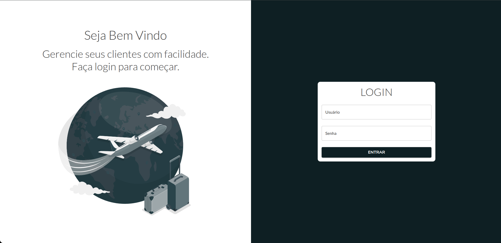
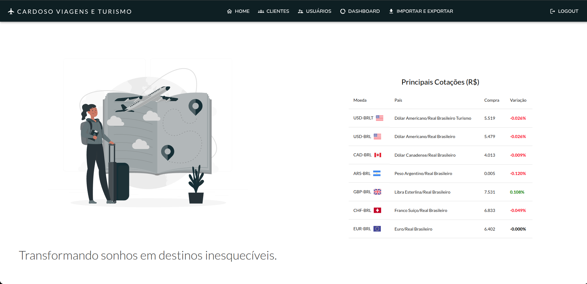
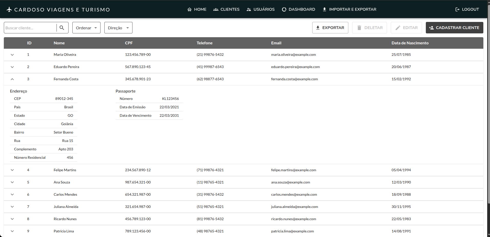

# Sistema de Gestão de Clientes - Agência de Viagens

## Descrição

Este é um projeto full-stack completo de um Sistema de Gestão de Clientes (CRM), desenhado para uma agência de viagens. A aplicação permite o gerenciamento de clientes, seus dados pessoais e de passaporte, além de um controle de acesso robusto baseado em papéis (roles) para os usuários do sistema.

O projeto foi totalmente containerizado com Docker e orquestrado com Docker Compose, demonstrando uma arquitetura moderna, portátil e pronta para produção.

O backend foi construído seguindo Clean Architecture, princípios SOLID e de Clean Code.

## Funcionalidades Principais

Autenticação e Autorização: Sistema de login seguro com Tokens JWT e controle de acesso baseado em papéis (ADMIN, MANAGER, USER).

Gerenciamento de Usuários (Apenas Admin): CRUD completo para os usuários do sistema.

Gerenciamento de Clientes: CRUD completo para os clientes da agência.

Dashboard Interativo: Visualização de métricas importantes, como total de clientes, novos clientes nos últimos 30 dias e status de passaportes (com e sem, e a vencer).

Busca e Paginação: Funcionalidade de busca dinâmica e paginação na listagem de clientes.

Validações Robustas: Validações de dados tanto no frontend (com Yup) quanto no backend (com Jakarta Validation).

## Tecnologias

### Backend

<div> 
   
   
   
   
   
   
</div>

### Frontend

<div>
   
   
   
   
   
   
</div>

## Imagens da Aplicação

<div>
    
    
    
</div>

## Como Executar o Projeto

Siga os passos abaixo para ter a aplicação completa rodando na sua máquina.

### Pré-requisitos

- Docker
- Docker Compose
- Git

### Passo a Passo

<div> 
   1. Clone o Repositório

```
git clone https://github.com/LucasRibasCardoso/app-gerenciamento-de-clientes
cd app-gerenciamento-de-clientes
```

</div>

<div>
2. Configure as Variáveis de Ambiente
   
Você precisa criar dois arquivos .env a partir dos exemplos.

#### Para o Backend e Banco de Dados (Modo DEV):

Na raiz do projeto, copie o arquivo de exemplo.

```
# Ativa o perfil 'dev' no Spring Boot para usar o banco em memória H2
PROFILE_APP=dev

# Variáveis para o serviço do MySQL (necessárias para o compose iniciar, mas não serão usadas pelo backend)
MYSQL_DATABASE=db_placeholder
MYSQL_ROOT_PASSWORD=pass_placeholder

# O JWT Secret do modo 'dev' está fixo no application-dev.properties, então este pode ficar em branco
JWT_SECRET=

# URL do cliente para o CORS
CLIENT_URL=http://localhost
```

#### Para o Frontend:

Dentro da pasta frontend/, copie o arquivo de exemplo.

```
# Define o prefixo que o Nginx usará para redirecionar as chamadas para o backend.
VITE_API_BACKEND_URL=/api

# Chave do AwesomeAPI de cotação de moedas.
VITE_CURRENCY_API_KEY=SUA_CHAVE_AQUI
```

</div>

<div>
3. Execute o comando abaixo para fazer o build da aplicação.

```
docker compose up --build -d
```

</div>

<div>
4. Acesse a Aplicação

Abra seu navegador e acesse: http://localhost

</div>

## Credenciais para Teste

Para facilitar os testes no ambiente de desenvolvimento (dev), uma conta administrador, gerente e usuário comum são criadas automaticamente. Utilize as seguintes credenciais para fazer login:

#### Administrador

- Usuário: userAdmin
- Senha: 12345678@

#### Gerente

- Usuário: userManager
- Senha: 12345678@

#### Usuário Comum

- Usuário: userCommon
- Senha: 12345678@
